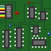

# Syrup
being a programming language for sequential circuits

# Installation

* First install `ghc` and `cabal` (https://www.haskell.org/ghcup/)
* Then get the content of this repository (https://github.com/pigworker/Syrup/archive/refs/heads/main.zip)
* Unzip it, change directory to `Syrup-main` and run `cabal install`
